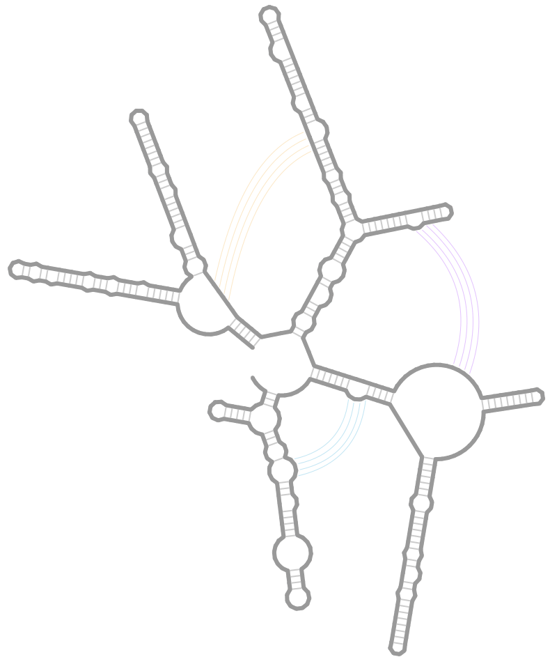

# RNA2Drawer 2

A [web app](https://rna2drawer2.app) for creating 2-D drawings of nucleic acid structures.
The layout, bonds and styling of a drawing can all be customized within the app.
Drawings are exported in PPTX and SVG formats
such that all elements of a drawing (e.g., bases and bonds)
are individual PPTX and SVG objects,
allowing for even further manipulation in PowerPoint and vector graphics editors such as Adobe Illustrator.

This project is a successor to the [first version](https://github.com/pzhaojohnson/RNA2Drawer#rna2drawer) of RNA2Drawer,
which was published in the journal <em>RNA Biology</em>.

&nbsp;&nbsp;&nbsp;&nbsp;<b>Article:</b> [https://doi.org/10.1080/15476286.2019.1659081](https://doi.org/10.1080/15476286.2019.1659081)
    
&nbsp;&nbsp;&nbsp;&nbsp;<b><em>If you use RNA2Drawer to draw structures in a publication, please cite the above article.</em></b>

If you have questions or experience issues, open an issue thread here on GitHub or email [help@rna2drawer.app](mailto:help@rna2drawer.app).
General comments and feature requests are also welcome!

  

## Creating a New Drawing

The form to create a new drawing can be accessed via the link on the home page
or via `File`: `New`.
In the form,
enter the sequence and the ID of the sequence
for your new drawing.

The structure for your drawing may also be entered in dot-bracket notation.
This notation is commonly created by structure prediction programs
such as Mfold and RNAFold
and may be referred to as "Vienna" format.

Example inputs can be selected at the top of the form.
Parameters controlling how the sequence and structure are read in
can be shown via the toggles at the top right corners of the text boxes.

## Saving a Drawing and Opening a Saved Drawing

Clicking the `File`: `Save` button will download a file with `.rna2drawer2` extension,
which contains a complete representation of your now saved drawing.
By default your web browser will place the file in your downloads folder,
though this can be changed in your browser settings.

To open a saved drawing,
navigate to the form to do so via the link on the home page
or via `File`: `Open`
and upload the saved file with `.rna2drawer2` extension.

<b><em>Opening a saved drawing from the first version of RNA2Drawer.</em></b>
Saved drawings from the first version of RNA2Drawer with `.rna2drawer` extension (missing the trailing "2") can also be opened,
though not all aspects of a drawing, namely the layout, will be preserved.
When a drawing from the first version is uploaded,
a note will appear listing the aspects of the drawing that will be preserved.

## Modes

Modes control how you interact with the bases of a drawing.

### Drag Stems

  

### Pair

  

### Flatten Loops and Flip Stems

  

### Edit Bases

  

## Line Drawings

The below drawing is an example of a line drawing.

  

The following attributes give it the appearance of a line drawing.

## Exporting Your Drawing

Drawings may be exported in SVG and PPTX formats.
SVG stands for scalable vector graphics
and SVG files may be opened with vector graphics editors
such as Adobe Illustrator and Inkscape.
PPTX is the file format of PowerPoint.

The forms to export drawings in SVG and PPTX formats
can be accessed via the `Export` dropdown.
In both forms,
the exported drawing can be scaled
by setting the font size of bases in the exported drawing.
All other elements are scaled to match the font size of bases in the exported drawing.

All elements of a drawing are exported as individual SVG and PPTX objects.
For example, bases are exported as text boxes
and primary and secondary bonds are exported as line objects.
This allows for further manipulation of the drawing
in vector graphics editors and PowerPoint.

## Frequently Asked Questions

<em>How do I delete a tertiary bond?</em> When selecting a tertiary bond, press the `Delete` key.

<em>How do I take a screenshot?</em> The app itself cannot take a screenshot,
though most operating systems have apps for taking screenshots
of the whole screen or just a portion of the screen,
such as the Snipping Tool on Windows.

## Funding

This material is based upon work supported by the National Science Foundation Graduate Research Fellowship Program under Grant No. DGE 1840340.
